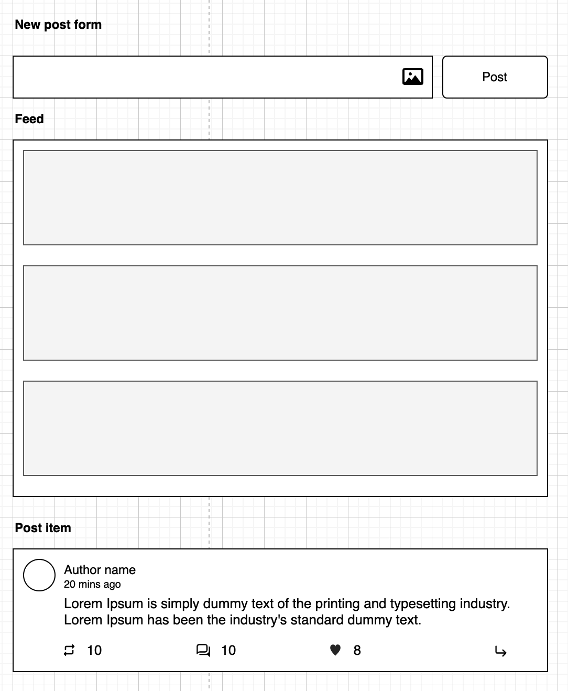
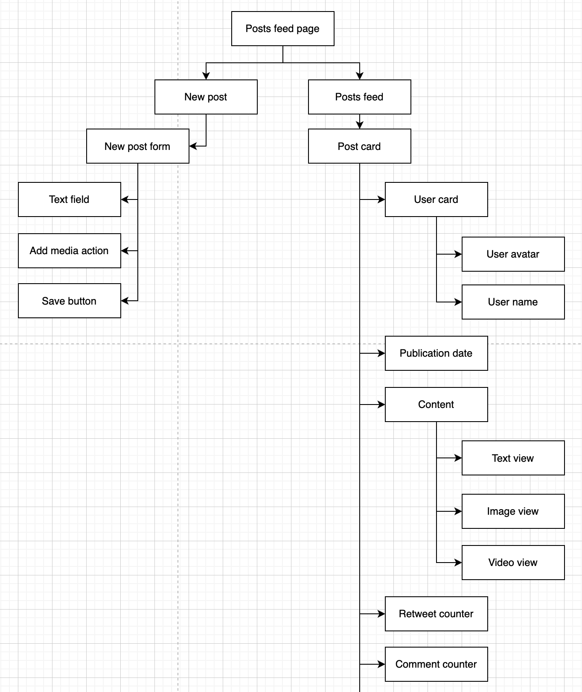

# Frontend System Design Framework

## Plan
* [General requirements](#general-requirements)
* [Functional requirements](#functional-requirements)
* [Components architecture](#components-architecture)
* [Dependencies](#dependencies)
* [Data entities](#data-entities)
* [API design](#api-design)
* [Store design](#store-design)
* [Optimization](#optimisation)
* [Accessibility](#accessibility)
* [Distribution](#distribution)

## General requirements
In the first section we should define the scope of the project and the general requirements. The questions that will help us define the right architecture:
 - What the product should we have in the end
 - What the typical user flow

Example _(imagine we are designing Instagram)_:

> The user should be able to
> - upload media content (photo/video)
> - follow friends
> - see his friends' photos in the feed
> - add comments under the photo
> - add likes
> - ...

## Functional requirements
Here we should define more technical requirements about how should our product work.

Questions to ask:
 - on which devices should it work
 - project-specific question:
   - should it have an infinity scroll
   - should it have an offline mode
   - should it have a real-time update
 - should it have configuration (make sense if we design module)
 - requirements about accessibility

## Components Architecture
In this section, it makes sense to draw basic UI parts to later refer to those pieces defining state and components API.



It shouldn't be like a final design. Just high-level blocks that show how you see the final product conceptually.

## Dependencies
After preparing and agreeing on the architectural vision of all important parts of our application, we should draw a dependencies graph for them.



As we can see here, it defines what approximately the component hierarchy will look like.

## Data entities
Now it's time to discuss the endpoints we need to make our system work. But before that, let us choose the technology we will use to connect the frontend to the backend.
Let us take a look at what options we have:
* REST API
* GraphQL
* Websocket
* Long polling
* SSE
* Something else?

But how do we decide what to use? What should we consider when making our decision?
Let us compare different options and choose the most appropriate one based on our requirements.

**REST API:**
* ✅ http benefits
* ✅ http2 compatibility
* ✅ simplicity
* ✅ easy to load balance
* ❗ can have long latency
* ❗ connections timeouts
* ❗ traffic overhead

**GraphQL:**
* ✅ nice modern API
* ✅ type safety
* ✅ advanced caching tools
* ✅ http benefits
* ✅ http2 compatibility
* ✅ easy to load balance
* ❗ can have long latency
* ❗ connections timeouts
* ❗ traffic overhead

**Websocket:**
* ✅ duplex communication
* ✅ super fast
* ❗ expensive
* ❗ http2 compatibility
* ❗ load-balancing problem
* ❗ need to do stuff to get http2 benefits
* ❗ firewall/proxies problem

**Long polling**
* ✅ http benefits
* ✅ simplicity
* ❗ can have long latency
* ❗ connections timeouts
* ❗ traffic overhead

**SSE**
* ✅ http2 benefits (gzipping, multiplexing…)
* ✅ receive only necessary information as text
* ✅ efficiency - don’t waste resources
* ✅ easy to load balance
* ❗ weird api
* ❗ unidirectional (we can’t send, only receive data)
* ❗ only text data

> Maybe the list here is not quite complete, but I will try to update it as soon as I know something new.

So we can easily decide what we should choose based on our requirements. For example - do we need real time in our application? If yes - should it be bidirectional real-time?
If we need unidirectional messaging - then we can consider SSE, in other cases Websocket makes more sense.

After we have made a decision about the technology, it makes sense to define the endpoints we need and the data structures we want to work with.

**Examples of endpoints we might have:**
```
   login(email, password): Token
   posts(token, { limit, cursor }): Post[]
   addPost(token, { message, media }): Post
   addComment(token, { parentId, text, media }): Comment
```

## API design
This section is usually make sense in case we are designing a component rather than a service. For example, our task is to build a reusable DataTable or Calendar component.
We are building a component that will be used by other developers, and we need to cover as many use cases as possible. Also, our component should be customizable and extensible.

For example, let us design an API for the Calendar component. It could look like the following:
```typescript
  type Calendar = {
    calendarType: "month" | "week";
    weekStartsOn?: 0 | 1 | 2 | 3 | 4 | 5 | 6;
    onMonthChange?: (month: Date) => void;
    onWeekChange?: (week: Date) => void;
    onDayClick?: (day: Date) => void;
    renderDay?: (day: Date) => HTMLElement;
    actions?: {
      nextMonthButton?: boolean;
      prevMonthButton?: boolean;
      monthSelector?: boolean;
      yearSelector?: boolean;
      monthSlider?: boolean;
      weekSlider?: boolean;
    };
    classes?: {
      root?: string;
      prevButton?: string;
      nextButton?: string;
      currentMonth?: string;
      week?: string;
      day: string;
      monthSlider?: boolean;
      weekSlider?: boolean;
    };
  };
```


## Store design
The next important section is a store design. We should define how we will store and work with data in our application. To define it I also recommend to use something like typescript types.

For example, let us see what the store of our posts application might look like:

```typescript
type User = {
  id: string;
  firstName: string;
  lastName: string;
  image?: string;
};

type MediaContent = {
  type: "photo" | "video";
  url: string;
  name?: string;
};

type Comment = {
  id: string;
  author: User;
  text: string;
  media?: MediaContent[];
  likes: number;
}

type Post = {
  id: string;
  author: User;
  text: string;
  media?: MediaContent[];
  likes: number;
  retweets: number;
  comments: Comment[];
};

type Store = {
  user: User; // we keep data about authenticated user
  posts: Post[]; // currently received posts
  cursor?: string; // we should have last received post id as an cursor for pagination
};
```

Here is a basic store definition where we have defined the main entities in our application. From this point, we can think about some further optimizations.

For example, let us imagine that we have requirements to have real-time updates for Likes in the post cards. This means that we have a websocket or SSE subscription and receive messages as follows:
```json
{
   "type": "likesUpdate",
   "payload": {
      "postId": "abc123",
      "likes": 256
   }
}
```

As we can see here, our store design is not optimal, as it is now necessary to find post in an array and then update the likes there. We could make a map to keep such statistics separate, for example:

```typescript
type Store = {
  user: User;
  posts: Post[];
  cursor?: string;
  postsLikes: Record<Post["id"], number>;
};
```

Now we can easily update the likes for each post in O(1) and read the value with the same complexity. In a similar way, we can easily highlight all the data flow challenges and solve them.

## Optimization
The next important part we should think about is optimization. Here I have prepared the main points that we should discuss in this section:

**Network**
* http 2
  * multiplexing
  * multiple connections
  * bundle splitting _(main bundle, vendor bundles etc.)_
* es6 bundle for modern devices
* webp for images (and fallback to png)
* minify resources
* non-critical resources with link ‘preconnect’
* debouncing requests
* caching 
  * server cache
  * browser cache
  * store something in app
* gzip
* throttle
* brottle
* use CDN

**Rendering**
* inline critical resources and put inside page
* non-critical resources - defer mode
* load ‘analytics’ scripts later
* SSR

**DOM**
* virtualization 
  * have limited amount of nodes _(like virtual scroll technique)_
  * soft-update _(don't delete nodes - update them)_
* perception _(use placeholders)_

**CSS**
* CSS animation _(instead js)_
* avoid reflow
* use css naming convention like BEM _(to avoid complex nested selectors)_

**JS**
* do stuff async
* web workers for complex staff
* do some operation on server side
* ship as fewer polyfills as we can
* service workers

## Accessibility
Very often, people with disabilities are simply ignored in web services. This is also an important issue to discuss.
Here I have prepared some points to talk about:

* keyboard navigation
  * list of shortcuts
  * tappable items
  * close shortcut
  * main functionality shortcuts
* visual optimisation _(we should use rems instead of px and so on)_
* screen reader friendly _(aria-live attributes for fields, aria-role's and so on)_
* color schemas _(for people with color disabilities)_
* images should have correct alt attribute
* semantic with HTML5

## Distribution
This small section only makes sense if we are designing a specific type of system. For example:
* reusable component
* embeddable script

So we just need to specify how we want to deliver our package to the customer. Will it be available in a private registry, or maybe we should specify a process to deliver it to a CDN and have versioning.
